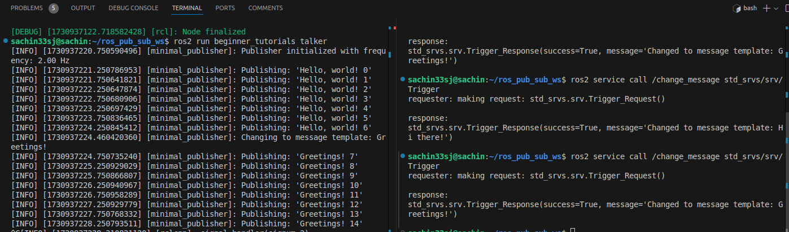

# my_beginner_tutorials
This repo is part is part of one of the excercises in ENPM700: Software Engineering in Robotics to create a simple Publisher Subscriber Node configuration

## Step 1: Create and navigate to your workspace
mkdir -p ~/ros2_ws/src
cd ~/ros2_ws/src

## Step 2: Clone the repository
git clone https://github.com/robosac333/my_beginner_tutorials.git

## Step 3: Build the workspace
Build for proper clang-tidy search
```sh
cd ~/ros2_ws
colcon build --cmake-args -DCMAKE_EXPORT_COMPILE_COMMANDS=ON
```

## Step 4: Source the setup file
source install/setup.bash

## Instructions to run nodes:
To start the publisher node, use:
```sh
ros2 run beginner_tutorials talker
```

To start the subscriber node, open a new terminal, source the workspace, and use:
```sh
source ~/ros2_ws/install/setup.bash
ros2 run beginner_tutorials listener
```
To start the nodes using different logging level checks use the relevant arguments such as -debug or -warn. Example:
```sh
ros2 run beginner_tutorials talker --ros-args --log-level debug
```

## Service implementation
To trigger the service and change the logging message by the talker node use:
```sh
ros2 service call /change_message std_srvs/srv/Trigger
```
After using the service, the published string while be changed as follows:



You may run the service to provide a different msg

## Launching nodes
To launch both the nodes together and publish to a different frequency, you may use the following command:
```sh
ros2 launch beginner_tutorials talker_listener.launch.py frequency:=5.0
```

## cpp-lint
To check if the code base conforms to cpp-lint style
```sh
cpplint --filter=-build/c++11,+build/c++17,-build/namespaces,-build/include_order $(find . -name *.cpp | grep -v "/build/")
```

### Dependencies

- Ubuntu 22.04 (If running locally)
- ROS2 Humble
- Git
- C++17
